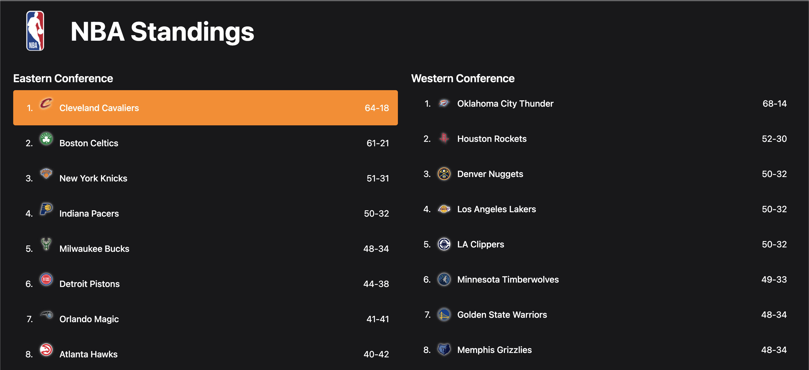
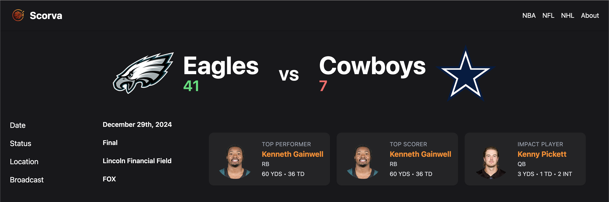
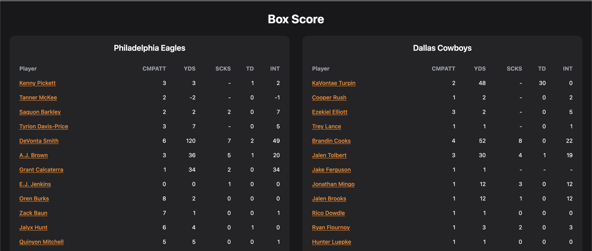
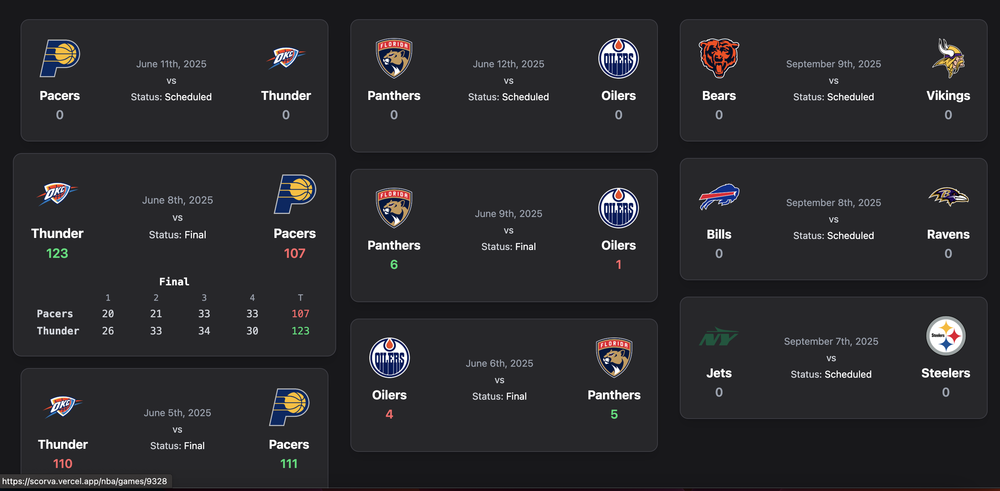
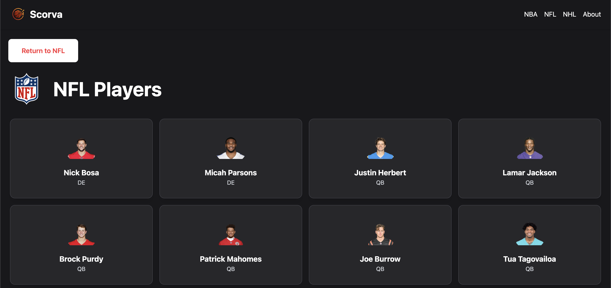
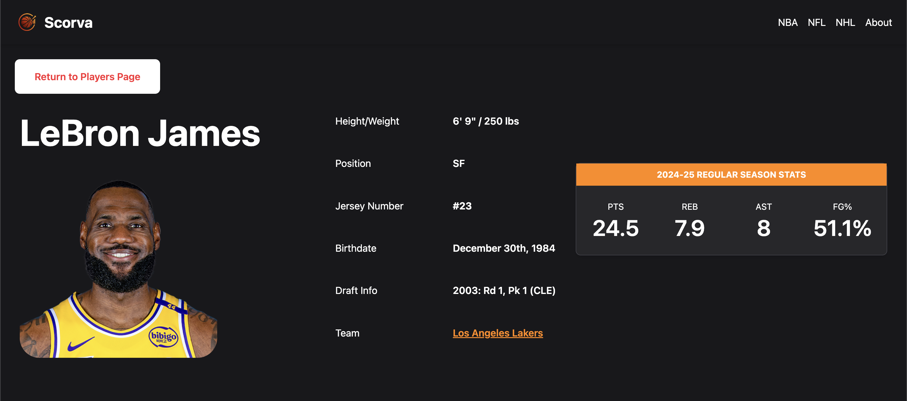
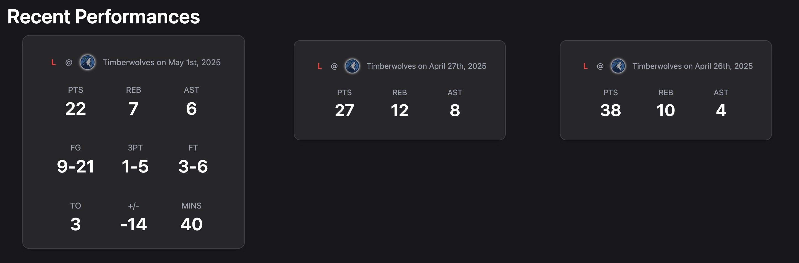
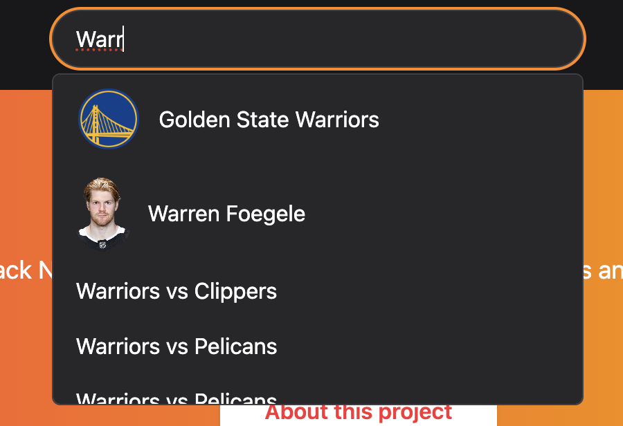

# Scorva 🏀🏒

**Scorva** is a full-stack sports statistics platform that lets users explore game results, player performances, and team data across NBA, NFL, and NHL leagues. It includes a React frontend, an Express backend, and a PostgreSQL database, deployed using Vercel and Railway.

---

## 🚀 Live

https://scorva.vercel.app

---

## 🛠️ Tech Stack

- **Frontend:** React, React Router, Tailwind CSS, Axios, Framer Motion, Vite
- **Backend:** Node.js, Express, pg (PostgreSQL)
- **Database:** PostgreSQL (hosted on Railway)
- **Deployment:**
  - Frontend: Vercel
  - Backend: Railway

---
## 🔒 API Security & Proxy Validation

- All frontend requests now route through backend-managed `/api/proxy/*` endpoints, preventing exposure of sensitive keys in the browser.
- The backend enforces an `x-api-key` check on every direct `/api/*` request, returning `403 Forbidden` when the header is missing or invalid.
- Proxy routes inject the server-side credential (`process.env.API_KEY`) when contacting internal services, keeping secrets confined to the backend environment.

## Project Structure

```
Scorva
├── backend
│   ├── src/
│   │   ├── index.js              # Express server entry point
│   │   ├── db/
│   │   │   └── db.js             # PostgreSQL connection setup
│   │   ├── routes/               # API route handlers
│   │   │   ├── games.js
│   │   │   ├── teams.js
│   │   │   ├── players.js
│   │   │   ├── search.js
│   │   │   ├── standings.js
│   │   │   └── ...
│   │   ├── config/
│   │   │   └── env.js            # dotenv initialization and environment setup
│   │   ├── utils/                # Shared helpers (e.g., logger, validation)
│   │   └── populate/             # Database seeding and update scripts
│   │       ├── historicalUpsert.js
│   │       ├── hourlyUpsert.js
│   │       └── src/
│   │           ├── commonMappings.js
│   │           ├── mapStatsToSchema.js
│   │           ├── eventProcessor.js
│   │           ├── upsertGame.js
│   │           ├── upsertPlayer.js
│   │           ├── upsertStat.js
│   │           └── upsertTeam.js
│   ├── package.json              # Backend dependencies
│   ├── package-lock.json
│   ├── backend.env.example       # Example backend environment variables
│   └── .env                      # Local backend environment (ignored by Git)
│
├── frontend
│   └── src/
│       ├── App.jsx               # Root React component
│       ├── main.jsx              # Entry point for Vite
│       ├── assets/               # Static assets (images, icons, etc.)
│       ├── components/           # Reusable UI components
│       │   ├── cards/            # GameCard, PlayerCard, etc.
│       │   ├── layout/           # Navbar, Footer, PageWrapper, ScrollToTop
│       │   └── ui/               # BoxScore, Hero, SearchBar
│       ├── pages/                # Page-level React components (routes)
│       ├── utilities/            # Helper functions and formatters
│       └── index.css             # Global styles
│
├── public/                       # Static public assets for Vite
├── screenshots/                  # Showcase images for documentation
├── .env                          # Frontend environment variables
├── eslint.config.js              # ESLint configuration
├── vite.config.js                # Vite configuration
├── package.json                  # Root scripts (frontend + backend)
├── vercel.json                   # Deployment configuration
├── index.html                    # Root HTML template for Vite
├── LICENSE
└── README.md

```

## 🔥 Features

- Multi-league support: NBA, NFL, NHL
- Search by player or team with autocomplete
- Live stats, box scores, and game details
- Ability to hover on game and stat cards for advanced details
- Real-time and historical ESPN API integration
- Responsive UI built with Tailwind and Framer Motion
- RESTful backend with Express and PostgreSQL
- Deployed on Vercel (frontend) and Railway (backend)

---

### 📸 Screenshots

<details>
  <summary>(click to expand)</summary>

### NBA Standings



### NFL Game



### NFL Box Score



### Game Cards & Hover for Quarter Breakdown



### NFL Player List



### NBA Player Information



### Recent Performance Card & Hover for Advanced Stats



### Search Bar with Dynamic Results & Autofill for teams, games, and players



</details>

## 📌 Future Improvements

- User accounts with saved teams, players, and preferences
- Multi-season history and archival access
- Live game alerts, final scores, and push notifications
- Mobile app (React Native or PWA)

## 🧩 Challenges Faced

- **Inconsistent Data from Unofficial APIs:**  
  ESPN’s APIs are not publicly documented and return different structures for each league (NBA, NFL, NHL). Normalizing player and game stats into a consistent PostgreSQL schema required extensive reverse-engineering and custom mapping logic.  
  → External API reference: [akeaswaran/espn-api gist](https://gist.github.com/akeaswaran/b48b02f1c94f873c6655e7129910fc3b)

- **Frontend–Backend Deployment Sync:**  
  Hosting the frontend on **Vercel** and backend on **Railway** caused CORS, routing, and environment variable issues during deployment. I resolved these by explicitly managing allowed origins, rewriting API routes, and validating endpoints across both environments.


## 🧠 Author

Made by **Yassin Benelhajlahsen** — Computer Science @ Brooklyn College  
[GitHub](https://github.com/yassinbenelhajlahsen) • [LinkedIn](https://www.linkedin.com/in/yassinbenelhajlahsen/)
