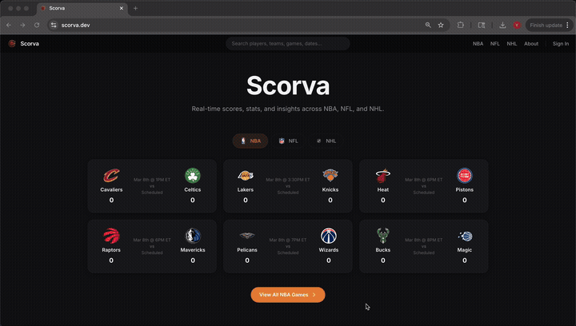
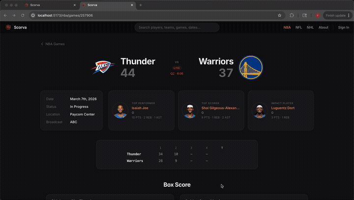
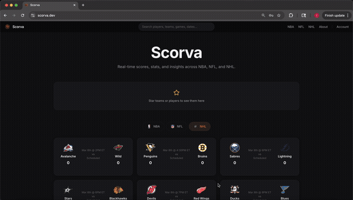
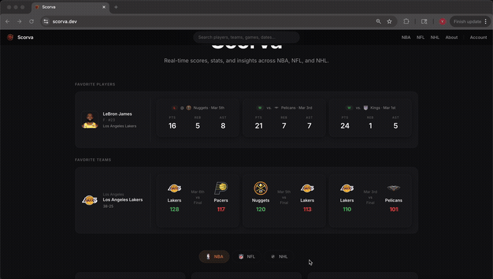
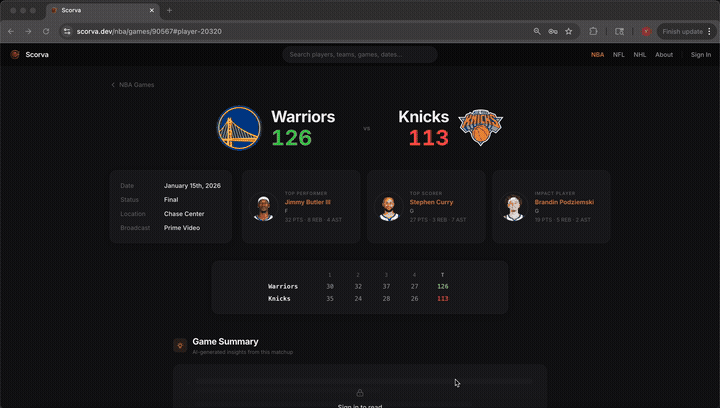
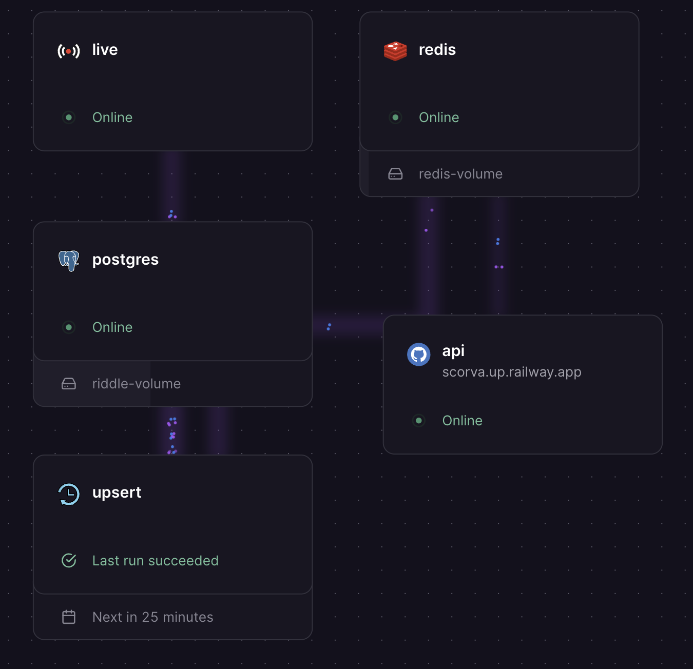

# Scorva

Full-stack sports statistics platform for NBA, NFL, and NHL. Covers live scores, historical game data, player profiles, box scores, and AI-generated game analysis. Built with React, Express, and PostgreSQL; deployed on Vercel and Railway.

---

## Live

https://scorva.dev

---

## Demos

| | |
|---|---|
|  |  |
| Homepage — favorites, league tabs, live scores | Live game updates via SSE |
|  |  |
| Player profile — stats, game log, top performances | Adding favorites and setting default league |

<div align="center">

**Sign in, AI game summary, full box score**



</div>

---

## Tech Stack

| Layer | Technologies |
|---|---|
| Frontend | React 19, React Router 7, Tailwind CSS v4, Framer Motion, Vite 6 |
| Backend | Node.js, Express 5, PostgreSQL (`pg`), Prisma 7 (schema/migrations only), Redis (ioredis) |
| Auth | Supabase Auth — email/password + Google OAuth; JWT verified server-side |
| AI | OpenAI GPT-4o-mini |
| Database | PostgreSQL — `pg_trgm` GIN indexes, window functions, `ON CONFLICT DO UPDATE` |
| Deployment | Vercel (frontend) · Railway (API server + live sync worker) |

## Project Structure

```
Scorva
├── backend
│   ├── prisma/                   # Schema, config, and migration history
│   ├── src/
│   │   ├── index.js              # Express server entry point
│   │   ├── db/db.js              # PostgreSQL pool singleton
│   │   ├── cache/                # Redis caching layer (cache.js, seasons.js)
│   │   ├── middleware/           # CORS, rate limiting, request logging, JWT auth
│   │   ├── routes/               # Thin route definitions (one per resource)
│   │   ├── controllers/          # Param extraction, response handling
│   │   ├── services/             # SQL queries and business logic
│   │   ├── utils/                # slugResolver, dateParser
│   │   ├── config/env.js         # dotenv initialization
│   │   └── populate/             # ESPN ingestion scripts: upsert.js (scheduled), liveSync.js (live worker)
│   └── __tests__/                # Jest + Supertest test suite
│
├── frontend
│   ├── src/
│   │   ├── App.jsx               # Root component and router
│   │   ├── main.jsx              # Vite entry point
│   │   ├── index.css             # Tailwind v4 theme tokens and global styles
│   │   ├── lib/supabase.js       # Supabase client singleton
│   │   ├── context/              # AuthContext — session state and auth modal
│   │   ├── api/                  # Backend API client and per-resource wrappers
│   │   ├── hooks/                # Data-fetching and state hooks
│   │   ├── components/           # Reusable UI (cards, layout, ui primitives)
│   │   ├── pages/                # Page-level route components
│   │   └── utilities/            # Formatters, slugify, normalize, topPlayers scoring
│   └── public/                   # League and playoff logos (NBA/, NFL/, NHL/)
│
├── LICENSE
└── README.md
```

## Architecture

Backend follows a strict 4-layer separation: Routes → Controllers → Services → DB. Routes delegate only; controllers extract params and send responses; services own all SQL via `pg` Pool; `db/db.js` exports a singleton. Caching is applied at the service layer via `cached()` from `backend/src/cache/cache.js`. All modules use ESM with `.js` extensions.

---

## Frontend Routes

| Path | Page |
|---|---|
| `/` | Homepage |
| `/about` | About |
| `/:league` | LeaguePage |
| `/:league/teams/:teamId` | TeamPage |
| `/:league/players/:playerId` | PlayerPage |
| `/:league/games/:gameId` | GamePage |
| `/settings` | SettingsPage (requires auth) |
| `/auth/callback` | AuthCallback (OAuth popup handler) |
| `*` | ErrorPage (404 catch-all) |

---

## Features

### Authentication & User Accounts

- Email/password and Google OAuth via Supabase Auth
- JWT validated server-side on all protected routes using `requireAuth` middleware
- Google OAuth uses a popup flow (`skipBrowserRedirect: true`) — child window closes via `postMessage` after the callback page completes
- Supabase auth webhook (`POST /webhooks/supabase-auth`) auto-creates user rows on signup: splits `full_name` for OAuth users, reads `first_name`/`last_name` metadata for email signups
- Account deletion: `DELETE /api/user/account` cascades favorites in DB then calls Supabase Admin API to remove the auth user

### Settings Page

Gear icon in the navbar opens `/settings` (requires auth):

- **Favorites tab:** search and add/remove favorite players and teams; choose a default homepage league (spring-animated sliding pill selector, optimistic local state)
- **Account tab:** edit display name (synced to both DB and Supabase user metadata), change password with current-password validation, delete account with confirmation. Password section is hidden for Google OAuth users; replaced with a "Signed in with Google" badge.

### Favorites

- Star players and teams from their profile pages
- Favorited items appear on the homepage with recent stat lines (players) and recent game cards (teams)
- Backend uses `ROW_NUMBER()` window functions to return the 3 most recent finalized entries per favorite, without subqueries
- `user_favorite_players` and `user_favorite_teams` tables with cascade deletes linked to `users` (Supabase UUID as PK)
- `favoritesService.ensureUser()` is a fallback upsert guard on first favorite action in case the webhook was missed

### Default League Preference

- Stored in `users.default_league`; fetched via `GET /api/user/profile`
- Homepage defers rendering league tabs until the preference resolves, preventing a flash of the wrong league

### Live Game Sync

A dedicated Railway worker (`liveSync.js`) runs a two-tier update cycle across all three leagues:

- **Fast path (every 15s):** `upsertGameScoreboard` — updates scores, clock, period, and quarter strings from the ESPN scoreboard endpoint only. No boxscore fetch.
- **Full path (every 2 min, or on period change):** `processEvent` — fetches the full boxscore and upserts player stats
- Per-event state tracked in a `Map` to decide which path to take each tick
- Sleeps 5 minutes when no live games are detected across all leagues
- Separate scheduled `upsert.js` runs every 30–60 minutes as a catch-up for scheduled games and season transitions; both workers use `ON CONFLICT DO UPDATE` so concurrent writes are safe

### Real-Time SSE

- `GET /live/:league/games` — streams live game list every 30s; emits `event: done` when no live games remain
- `GET /live/:league/games/:gameId` — streams full game detail every 30s; emits `event: done` when game status is Final
- 15-second `: ping` heartbeat; `X-Accel-Buffering: no` header for Railway reverse-proxy compatibility
- Mounted before `generalLimiter` to avoid SSE connections being counted against rate limits
- Frontend `useLiveGames` and `useLiveGame` hooks integrate into `useHomeGames`, `useLeagueData`, and `useGame`; fall back to REST polling after 3 consecutive SSE failures. Pass `null` to deactivate without breaking hook rules.

### AI Game Summaries

- On-demand, lazy-generated analysis for completed games via OpenAI GPT-4o-mini
- Cache-first: summary stored in `games.ai_summary`, never regenerated after initial creation (~$0.0001/summary, ~$3/month at 1,000 daily unique views)
- Produces 3–4 structured bullet points: why the winner won, top performances, key statistical advantages
- Protected by `requireAuth` middleware + a dedicated stricter rate limiter (`aiLimiter`, 50 req/15 min in production)
- 30-second timeout with graceful fallback; locked UI shown to unauthenticated users with sign-in prompt

### Redis Caching

Service-layer caching via `ioredis` with tiered TTLs based on data volatility:

- **30-day cache**: finalized game detail (`gameInfoService`), past-season standings, past-season player stats, past-season game lists — immutable once finalized
- **Short TTL (30s–5min)**: current-season standings (5 min), current-season player stats (2 min), today's default game list (30s)
- **24h cache**: team lists, player lists, available seasons
- **Not cached**: favorites, user profile, search, AI summaries (DB-persisted), SSE endpoints

Graceful fallback: if `REDIS_URL` is unset, all cache ops are no-ops — no behavior change in local dev or tests. Cache invalidation runs inside `upsertGame.js`, `liveSync.js`, and `upsert.js` on every write. Graceful shutdown calls `closeCache()` on `SIGTERM`.

### Intelligent Search

Single-query, relevance-ranked search across players, teams, and games:

- `pg_trgm` GIN indexes on `players.name`, `teams.name`, and `teams.shortname` for fuzzy matching
- Custom `ORDER BY` ranks: exact match (0) → prefix (1) → substring (2) → trigram `similarity()` score
- Date-aware: `tryParseDate()` resolves `2025-01-15`, `12/25`, and `Jan 15` against the current app season
- Game results display a formatted date to disambiguate same-team matchups

### Playoff Detection

- `games.game_label` stores ESPN playoff round labels sourced from `event.competitions[0].notes[0].headline` when `event.season.type === 3`
- Examples: `"NBA Finals - Game 1"`, `"Super Bowl LIX"`, `"Stanley Cup Final - Game 3"`
- GameCard and GamePage display league-specific playoff or finals logos in place of generic text badges

### Top Players Analysis

Three deduplicated highlight cards computed on the frontend from box score data (`topPlayers.js`):

| Card | What it measures |
|---|---|
| **Top Performer** | Weighted composite score by league |
| **Top Scorer** | Highest output in the primary scoring category |
| **Impact Player** | Defensive contribution or on-ice differential |

Players are deduplicated across slots — if the top performer is also the top scorer, the next best scorer fills that card.

**Scoring formulas:**

NBA (Hollinger-inspired):
```
Performance = PTS + (0.4 × REB) + (0.7 × AST) + STL + BLK − TOV
Impact      = +/− + (1.5 × STL) + BLK
```

NFL (position-agnostic):
```
Performance = (YDS × 0.05) + (CMP × 0.3) + (TD × 10) − (INT × 4) + (SCKS × 5)
Impact      = (SCKS × 5) + (INT × 6) + (YDS × 0.02)
```

NHL (saves-aware so goalies can surface):
```
Performance = (G × 2.0) + (A × 1.5) + (SHOTS × 0.15) + (SAVES × 0.1) + (BS × 0.4) + (HT × 0.2)
Impact      = (+/− × 1.5) + G + A
```

---

## Database Schema

Seven tables: `games`, `teams`, `players`, `stats`, `users`, `user_favorite_players`, `user_favorite_teams`.

- `pg_trgm` GIN indexes on `players.name`, `teams.name`, and `teams.shortname` for sub-millisecond fuzzy search
- Compound unique constraints on `(espn_playerid, league)` and `(eventid, league)` to support safe multi-league upserts
- `stats` uses a composite primary key `(gameid, playerid)` — no surrogate key
- Cascade deletes: `users` → favorites; `teams`/`players` → `stats`; `games` → `stats`
- `games.ai_summary` caches LLM output; `games.game_label` stores playoff labels; `games.current_period` and `games.clock` are written by the live sync worker

---

## Testing

```bash
# Frontend
cd frontend && npm test
cd frontend && npm run test:coverage

# Backend
cd backend && npm test
cd backend && npm run test:coverage

# Lint + test + build (what CI runs)
cd frontend && npm run verify
```

### Backend (Jest 29 + Supertest)

- **All API routes** — teams, players, games, game detail (`gameInfo`), player detail (`playerInfo`), standings, seasons, search
- **Auth-protected routes** — favorites, user profile, AI summary, account deletion
- **Webhook handler** — Supabase auth event parsing, user creation, name extraction for email and OAuth signup flows
- **Live SSE routes** — stream lifecycle, 15s heartbeat, `done` event on game completion
- **Database layer** — connection pooling, `pg` Pool error handling
- **Data ingestion** — `mapStatsToSchema`, `upsertPlayer`, `upsertTeam`, `upsertGame`, `upsertStat`, `eventProcessor`, `upsertGameScoreboard` (live sync fast path)
- **Cache module** — Redis `cached()`, `invalidate()`, `invalidatePattern()`, graceful fallback when `REDIS_URL` unset
- **Service unit tests** — `aiSummaryService` cache-first logic, summary generation, error handling
- **Integration** — full Express app behavior across all mounted routes
- Pattern: mock `db/db.js` via `jest.unstable_mockModule()`; `createMockPool()` stubs `.query()`; season-aware routes also mock `cache/seasons.js`



### Frontend (Vitest + Testing Library)

- **Utility functions** — `formatDate`, `getPeriodLabel` (NBA/NFL/NHL periods + OT), `slugify`, `normalize`, `computeTopPlayers`
- **API client** — URL construction, headers, body serialization, abort signal, 204 handling, error propagation
- **API wrappers** — favorites, user profile, search
- **Hooks** — `useFavorites`, `useFavoriteToggle` (optimistic updates + rollback), `useUserPrefs`, `useSearch` (debounce + abort cancel), `useLiveGame`, `useLiveGames` (SSE lifecycle, REST fallback, `done` event handling)
- **Components** — Navbar (auth state variants), PasswordChecklist (validation logic and rendering)

---

## CI/CD

GitHub Actions runs `cd frontend && npm run verify` (lint + Vitest + production build) on every push and pull request. Vercel deployment only proceeds after all checks pass on `main`. The backend deploys independently via Railway on push to `main`.

---

## Author

Made by **Yassin Benelhajlahsen** — Computer Science @ Brooklyn College
[GitHub](https://github.com/yassinbenelhajlahsen) · [LinkedIn](https://www.linkedin.com/in/yassin-benelhajlahsen/)
