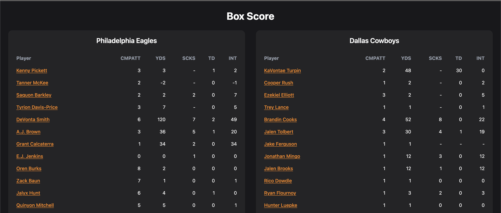

# Scorva 🏀🏒

**Scorva** is a full-stack sports statistics platform that lets users explore game results, player performances, and team data across NBA, NFL, and NHL leagues. It includes a React frontend, an Express backend, and a PostgreSQL database, deployed using Vercel and Railway.

---

## 🚀 Live Demo

https://scorva.vercel.app  


---

## 🛠️ Tech Stack

- **Frontend:** React, React Router, Tailwind CSS, Axios, Framer Motion, Vite  
- **Backend:** Node.js, Express, pg (PostgreSQL)  
- **Database:** PostgreSQL (hosted on Railway)  
- **Deployment:**  
  - Frontend: [Vercel](https://vercel.com)  
  - Backend: [Railway](https://railway.app)
---

## Project Structure

```
Scorva
├── backend
│   ├── index.js              # Entry point for Express server
│   ├── db.js                 # PostgreSQL connection setup
│   ├── routes/               # API routes
│   │   ├── games.js
│   │   ├── teams.js
│   │   └── ...
│   ├── populateDB/           # Scripts to fetch and insert data into DB
│   ├── package.json          # Backend dependencies
│   └── .env                  # Local environment variables (not committed)
└── frontend
    ├── src/
    │   ├── main.jsx          # Entry point for React app
    │   ├── components/       # Reusable UI components
    │   └── ...
    ├── index.html            # HTML template
    ├── package.json          # Frontend dependencies
    └── tailwind.config.js    # Tailwind CSS configuration
```


## 🔥 Features

-  Multi-league support: NBA, NFL, NHL
-  Search by player or team with autocomplete
-  Live stats, box scores, and game details
-  Ability to hover on game and stat cards for advanced details
-  Real-time and historical ESPN API integration
-  Responsive UI built with Tailwind and Framer Motion
-  RESTful backend with Express and PostgreSQL
-  Deployed on Vercel (frontend) and Railway (backend)

---

### 📸 Screenshots


<details>
  <summary>(click to expand)</summary>

###  NBA Standings


###  NFL Game 


###  NFL Box Score


###  Game Cards & Hover for Quarter Breakdown


###  NFL Player List


###  NBA Player Information


###  Recent Performance Card & Hover for Advanced Stats


###  Search Bar with Dynamic Results & Autofill for teams, games, and players


</details>

## 📌 Future Improvements

-  User accounts with saved teams, players, and preferences  
-  Multi-season history and archival access  
-  Live game alerts, final scores, and push notifications  
-  Mobile app (React Native or PWA)

## 🧩 Challenges Faced

- **Inconsistent Data from Unofficial APIs:**  
  ESPN’s APIs are not publicly documented and return different structures for each league (NBA, NFL, NHL). Normalizing player and game stats into a consistent PostgreSQL schema required extensive reverse-engineering and custom mapping logic.  
  → External API reference: [akeaswaran/espn-api gist](https://gist.github.com/akeaswaran/b48b02f1c94f873c6655e7129910fc3b)

- **Frontend–Backend Deployment Sync:**  
  Hosting the frontend on **Vercel** and backend on **Railway** caused CORS, routing, and environment variable issues during deployment. I resolved these by explicitly managing allowed origins, rewriting API routes, and validating endpoints across both environments.

## 🧑‍💻 Getting Started

To run Scorva locally:

<details>
  <summary>(click to expand)</summary>


### 1. Clone the repo
```
git clone https://github.com/yassinbenelhajlahsen/scorva
cd scorva
```
### 2. Install dependencies
```
cd backend && npm install
cd ../frontend && npm install
```

### 3. Setup environment variables

```
cd backend
cp .env.example .env
```

### 4. Start the app
Open two terminals:
```
# Terminal 1 (backend)
cd backend
npm run dev

# Terminal 2 (frontend)
cd frontend
npm run dev
```
</details>

## 🧠 Author

Made by **Yassin Benelhajlahsen** — Computer Science @ Brooklyn College  
[GitHub](https://github.com/yassinbenelhajlahsen) • [LinkedIn](https://www.linkedin.com/in/yassinbenelhajlahsen/)
